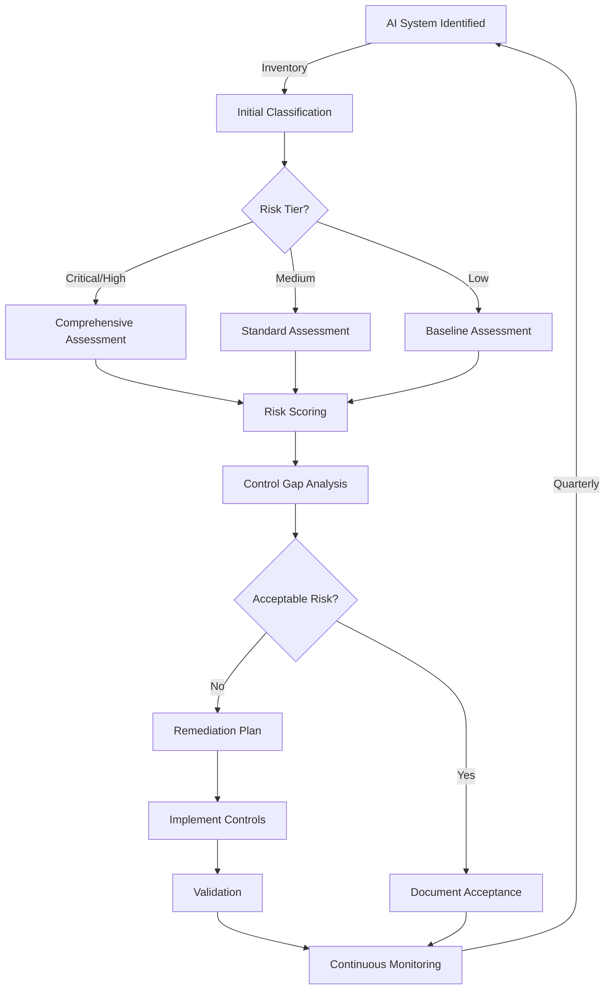

# AI Risk Assessment Workflow
## Operational Implementation Guide

**Version**: 1.0
**Effective Date**: 2026-03-04
**Process Owner**: Security Operations Team
**Automation Level**: Semi-Automated

---

## 1. Workflow Overview



---

## 2. Step-by-Step Procedures

### Step 1: AI System Discovery & Registration

**Trigger**: New AI system deployment, vendor onboarding, or quarterly review

**Actions**:
1. System owner submits AI registration form
2. Security team validates submission
3. Assign unique System ID (AI-XXX)
4. Create record in inventory database

**Automation**:
```bash
# C3PO Command
/ai-inventory register --name "System Name" --vendor "Vendor" --owner "Owner Email"

# This triggers:
- Jira ticket creation
- Vanta asset registration
- Initial risk tier assignment
```

**SLA**: 2 business days

---

### Step 2: Initial Risk Classification

**Inputs**: System details, data sensitivity, use case

**Classification Matrix**:
```python
def calculate_initial_tier(system):
    score = 0

    # Data sensitivity scoring
    if system.data_type in ["PII", "PHI", "PCI"]:
        score += 4
    elif system.data_type == "CONFIDENTIAL":
        score += 3
    elif system.data_type == "INTERNAL":
        score += 2
    else:
        score += 1

    # User scope scoring
    if system.user_scope == "PUBLIC":
        score += 4
    elif system.user_scope == "EXTERNAL":
        score += 3
    elif system.user_scope == "DEPARTMENT":
        score += 2
    else:
        score += 1

    # Decision authority scoring
    if system.decision_type == "AUTONOMOUS":
        score += 4
    elif system.decision_type == "SEMI_AUTONOMOUS":
        score += 3
    elif system.decision_type == "ADVISORY":
        score += 2
    else:
        score += 1

    # Determine tier
    if score >= 10:
        return "CRITICAL"
    elif score >= 7:
        return "HIGH"
    elif score >= 4:
        return "MEDIUM"
    else:
        return "LOW"
```

**Output**: Risk tier assignment (Critical/High/Medium/Low)

---

### Step 3: Risk Assessment Execution

#### For Critical/High Risk Systems

**Assessment Components**:

1. **MITRE ATLAS Threat Modeling**
   ```yaml
   Threats to Assess:
     - Model Poisoning (MS-001)
     - Model Extraction (MS-002)
     - Adversarial Inputs (MS-003)
     - Data Leakage (DP-001)
     - Bias/Fairness (GC-001)
   ```

2. **Control Validation Checklist**
   - [ ] Authentication mechanisms verified
   - [ ] Encryption standards confirmed
   - [ ] Access controls tested
   - [ ] Monitoring configured
   - [ ] Audit logging enabled
   - [ ] Incident response procedures documented
   - [ ] Data retention policies applied
   - [ ] Third-party assessments completed

3. **Evidence Collection**
   ```bash
   # Automated evidence gathering
   /cpoe-manage collect --system AI-001 --framework HITRUST

   # Generates:
   - Configuration screenshots
   - Policy documents
   - Access logs
   - Monitoring dashboards
   - Vendor attestations
   ```

#### For Medium Risk Systems

**Simplified Assessment**:
- Core security controls only
- Annual vendor review
- Quarterly configuration check

#### For Low Risk Systems

**Baseline Assessment**:
- Authentication verification
- Basic monitoring check
- Annual attestation

---

### Step 4: Risk Scoring Calculation

**Automated Scoring Algorithm**:

```javascript
function calculateRiskScore(assessment) {
    const threatLikelihood = assessment.threat_likelihood; // 1-5
    const impactSeverity = assessment.impact_severity; // 1-5
    const controlGap = assessment.control_gap; // 0.1-1.0
    const mitigationEffectiveness = assessment.mitigation; // 1-5

    const rawScore = (threatLikelihood * impactSeverity * controlGap);
    const adjustedScore = rawScore / mitigationEffectiveness;

    return {
        score: adjustedScore.toFixed(1),
        rating: getRating(adjustedScore),
        action: getRequiredAction(adjustedScore)
    };
}

function getRating(score) {
    if (score >= 15) return "CRITICAL";
    if (score >= 10) return "HIGH";
    if (score >= 5) return "MEDIUM";
    if (score >= 2) return "LOW";
    return "MINIMAL";
}
```

---

### Step 5: Control Gap Analysis

**Gap Identification Process**:

1. **Compare to HITRUST Requirements**
   ```sql
   SELECT
     h.control_id,
     h.control_name,
     h.requirement,
     CASE
       WHEN a.implementation_status IS NULL THEN 'NOT IMPLEMENTED'
       ELSE a.implementation_status
     END as status
   FROM hitrust_controls h
   LEFT JOIN ai_system_controls a
     ON h.control_id = a.control_id
     AND a.system_id = 'AI-001'
   WHERE h.applicable_to_ai = TRUE
   ORDER BY h.priority DESC;
   ```

2. **Generate Gap Report**
   - Missing controls
   - Partial implementations
   - Evidence deficiencies
   - Remediation priorities

---

### Step 6: Remediation Planning

**For Critical/High Risks**:

```markdown
## Remediation Plan Template

### System: [AI System Name]
### Risk Level: [CRITICAL/HIGH]
### Target Completion: [Date]

#### Priority 1 - Immediate (0-30 days)
- [ ] Control: [Control Name]
  - Gap: [Description]
  - Action: [Specific steps]
  - Owner: [Name]
  - Evidence: [What to collect]

#### Priority 2 - Short-term (31-60 days)
- [ ] Control: [Control Name]
  - Gap: [Description]
  - Action: [Specific steps]
  - Owner: [Name]
  - Evidence: [What to collect]

#### Priority 3 - Medium-term (61-90 days)
- [ ] Control: [Control Name]
  - Gap: [Description]
  - Action: [Specific steps]
  - Owner: [Name]
  - Evidence: [What to collect]
```

---

### Step 7: Implementation Validation

**Validation Checklist**:

1. **Technical Validation**
   ```bash
   # Run security scans
   /security-scan infrastructure --target ai-system-001

   # Verify configurations
   /devsecops-review iac --system vertex-ai

   # Test controls
   /ai-control-test --system AI-001 --control MS-001
   ```

2. **Process Validation**
   - Review updated procedures
   - Confirm training completion
   - Verify documentation updates

3. **Evidence Validation**
   - Screenshots captured
   - Logs configured
   - Reports generated

---

### Step 8: Continuous Monitoring Setup

**Monitoring Configuration**:

```yaml
AI_System_Monitoring:
  AI-001_Vertex:
    metrics:
      - model_drift_score
      - inference_latency
      - error_rate
      - api_usage
    alerts:
      - drift_threshold: 0.15
      - latency_threshold: 500ms
      - error_threshold: 5%
    siem_integration:
      platform: Google_SecOps
      log_source: vertex-ai-logs
      correlation_rules:
        - anomaly_detection
        - threshold_breach
        - pattern_matching
    reporting:
      frequency: weekly
      recipients:
        - security-team@merge.gov
        - ai-owners@merge.gov
```

---

## 3. Automation Tools & Scripts

### 3.1 Risk Assessment Automation

```bash
#!/bin/bash
# ai-risk-assess.sh - Automated AI Risk Assessment

SYSTEM_ID=$1
ASSESSMENT_TYPE=$2

echo "Starting AI Risk Assessment for $SYSTEM_ID"

# Step 1: Fetch system details
system_data=$(curl -s "https://api.vanta.com/v1/assets/$SYSTEM_ID" \
  -H "Authorization: Bearer $VANTA_API_KEY")

# Step 2: Run MITRE ATLAS checks
atlas_score=$(/c3po/bin/atlas-check --system "$SYSTEM_ID")

# Step 3: Check control implementation
control_gaps=$(/c3po/bin/hitrust-check --system "$SYSTEM_ID" --framework AI2)

# Step 4: Calculate risk score
risk_score=$(python3 /c3po/scripts/risk_calculator.py \
  --system "$system_data" \
  --threats "$atlas_score" \
  --controls "$control_gaps")

# Step 5: Generate report
/c3po/bin/generate-report \
  --system "$SYSTEM_ID" \
  --score "$risk_score" \
  --output "/reports/AI-Risk-$SYSTEM_ID-$(date +%Y%m%d).pdf"

# Step 6: Update tracking
jira_issue=$(curl -X POST "https://merge.atlassian.net/rest/api/3/issue" \
  -H "Authorization: Basic $JIRA_AUTH" \
  -H "Content-Type: application/json" \
  -d "{
    \"fields\": {
      \"project\": {\"key\": \"SEC\"},
      \"summary\": \"AI Risk Assessment - $SYSTEM_ID\",
      \"description\": \"Risk Score: $risk_score\",
      \"issuetype\": {\"name\": \"Risk Assessment\"}
    }
  }")

echo "Assessment complete. Jira ticket: $jira_issue"
```

### 3.2 Continuous Monitoring Integration

```python
# monitor_ai_risks.py - Real-time AI risk monitoring

import json
import time
from datetime import datetime
from google.cloud import monitoring_v3
from google.cloud import securitycenter

class AIRiskMonitor:
    def __init__(self):
        self.monitoring_client = monitoring_v3.MetricServiceClient()
        self.security_client = securitycenter.SecurityCenterClient()

    def check_model_drift(self, system_id):
        """Check for model performance drift"""
        query = f"""
        fetch ai.googleapis.com/Model
        | metric 'aiplatform.googleapis.com/model/prediction/error_rate'
        | filter resource.model_id == '{system_id}'
        | group_by 1h, [value_error_rate_mean: mean(value.error_rate)]
        | every 1h
        """

        results = self.monitoring_client.list_time_series(
            request={"name": f"projects/{PROJECT_ID}", "filter": query}
        )

        for result in results:
            if result.points[0].value.double_value > 0.05:
                self.create_alert(system_id, "MODEL_DRIFT", result)

    def check_adversarial_patterns(self, system_id):
        """Detect potential adversarial input patterns"""
        # Check for unusual input patterns
        suspicious_patterns = [
            "repeated_identical_requests",
            "boundary_value_testing",
            "format_string_attempts",
            "unicode_exploitation"
        ]

        for pattern in suspicious_patterns:
            if self.detect_pattern(system_id, pattern):
                self.create_finding(system_id, pattern)

    def create_finding(self, system_id, threat_type):
        """Create security finding in Google Security Command Center"""
        finding = {
            "name": f"organizations/{ORG_ID}/sources/{SOURCE_ID}/findings/{threat_type}_{timestamp}",
            "resource_name": f"//aiplatform.googleapis.com/projects/{PROJECT_ID}/models/{system_id}",
            "state": "ACTIVE",
            "category": "AI_RISK",
            "severity": self.calculate_severity(threat_type),
            "event_time": datetime.now().isoformat(),
            "finding_class": "THREAT",
        }

        self.security_client.create_finding(
            request={"parent": f"organizations/{ORG_ID}/sources/{SOURCE_ID}", "finding": finding}
        )

if __name__ == "__main__":
    monitor = AIRiskMonitor()

    # Continuous monitoring loop
    while True:
        for system in AI_SYSTEMS:
            monitor.check_model_drift(system['id'])
            monitor.check_adversarial_patterns(system['id'])

        time.sleep(300)  # Check every 5 minutes
```

---

## 4. Integration Points

### Vanta Integration
- Automated evidence collection
- Control status tracking
- Compliance dashboard updates

### Google SecOps SIEM
- Real-time threat detection
- Correlation rule processing
- Incident triggering

### Jira Workflow
- Assessment task creation
- Remediation tracking
- Status reporting

### GitHub Actions
```yaml
name: AI Risk Assessment Pipeline

on:
  schedule:
    - cron: '0 0 * * 1'  # Weekly on Monday
  workflow_dispatch:

jobs:
  assess-ai-risks:
    runs-on: ubuntu-latest
    steps:
      - uses: actions/checkout@v3

      - name: Fetch AI Inventory
        run: |
          curl -o inventory.json \
            "https://api.vanta.com/v1/assets?type=ai_system" \
            -H "Authorization: Bearer ${{ secrets.VANTA_API_KEY }}"

      - name: Run Risk Assessments
        run: |
          for system in $(jq -r '.assets[].id' inventory.json); do
            ./scripts/ai-risk-assess.sh $system full
          done

      - name: Generate Compliance Report
        run: |
          python3 scripts/generate_hitrust_evidence.py \
            --framework AI2 \
            --output reports/

      - name: Upload to Vanta
        run: |
          for report in reports/*.pdf; do
            curl -X POST "https://api.vanta.com/v1/evidence" \
              -H "Authorization: Bearer ${{ secrets.VANTA_API_KEY }}" \
              -F "file=@$report" \
              -F "control_id=AI2-09.01"
          done
```

---

## 5. Reporting & Dashboards

### Executive Dashboard Metrics
- Active AI systems by risk tier
- Average risk score trend
- Control implementation percentage
- Open remediation items
- Time to remediate by severity

### Operational Reports
- Weekly risk assessment summary
- Monthly control gap analysis
- Quarterly vendor assessment status
- Annual risk taxonomy review

---

## 6. RACI Matrix

| Activity | Security Team | AI Owner | CISO | Vendor |
|----------|--------------|----------|------|--------|
| System Registration | I | R | A | C |
| Risk Assessment | R | C | A | I |
| Control Implementation | C | R | A | I |
| Evidence Collection | R | C | I | C |
| Monitoring | R | I | I | I |
| Incident Response | R | I | A | C |
| Audit Support | R | C | A | C |

**Legend**: R=Responsible, A=Accountable, C=Consulted, I=Informed

---

## 7. Success Metrics

| KPI | Target | Current | Status |
|-----|--------|---------|--------|
| Systems Assessed | 100% | 75% | ⚠️ |
| Critical Risks Mitigated | <2 | 1 | ✅ |
| Assessment Cycle Time | <5 days | 7 days | ⚠️ |
| Control Coverage | >85% | 82% | ⚠️ |
| Automation Rate | >60% | 45% | ❌ |

---

*This workflow is maintained by the Security Operations Team*
*Last review: 2026-03-04*
*Next review: 2026-04-01*