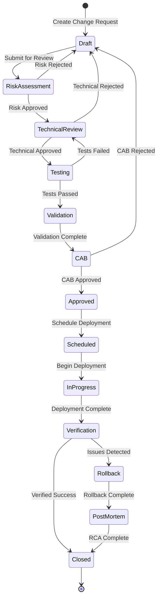

# AI Model Change Management - Jira Workflow Design
*Created: 2026-03-09*
*Purpose: HITRUST r2/AI2 Compliance - Change Control for AI Models*
*Owner: CISO / IT Operations*

## Executive Summary

This workflow ensures all AI model changes (training, deployment, configuration) follow a controlled, auditable process that meets HITRUST AI2 requirements. The workflow enforces risk assessment, testing, approval gates, and rollback procedures for AI/ML model updates.

**Compliance Drivers**:
- HITRUST r2 Control 06.d - Change Management
- HITRUST AI2 - AI Lifecycle Management
- NIST AI RMF 1.0 - Govern 1.2

---

## Workflow Overview



---

## Jira Configuration

### 1. Issue Type Configuration

**Create New Issue Type**: "AI Model Change"

```json
{
  "name": "AI Model Change",
  "description": "Track changes to AI/ML models including training, deployment, and configuration",
  "icon": "brain-icon",
  "fields": {
    "required": [
      "summary",
      "ai_system",
      "change_type",
      "risk_level",
      "model_version",
      "business_justification"
    ],
    "optional": [
      "rollback_plan",
      "test_results",
      "performance_metrics"
    ]
  }
}
```

### 2. Custom Fields

| Field Name | Field Type | Description | Options/Format |
|------------|------------|-------------|----------------|
| AI System | Select List | Target AI system | AIgency, Vertex AI, Claude, Jasper, Custom |
| Change Type | Select List | Type of change | New Model, Retrain, Configuration, Prompt Engineering, Decommission |
| Risk Level | Select List | Assessed risk | Critical, High, Medium, Low |
| Model Version | Text Field | Version identifier | v1.2.3 format |
| Training Data Source | Text Field | Data used for training | Dataset ID/location |
| Performance Baseline | Number Fields | Current metrics | Accuracy, F1, Latency |
| Expected Impact | Text Area | Business impact | Free text |
| Rollback Plan | Text Area | Rollback procedure | Required for Critical/High |
| Test Evidence | Attachment | Test results | Files/links |
| Compliance Check | Checkboxes | Compliance items | Data Privacy, Bias Testing, Security Scan, Documentation |
| CAB Decision | Select List | Approval status | Approved, Rejected, Deferred |
| Deployment Window | Date/Time | Scheduled deployment | DateTime picker |

### 3. Workflow States

| State | Description | Permissions | SLA |
|-------|-------------|-------------|-----|
| **Draft** | Initial creation, editing | Creator/AI Team | No limit |
| **Risk Assessment** | Security/compliance review | Security Team | 2 business days |
| **Technical Review** | Architecture/engineering review | Tech Leads | 1 business day |
| **Testing** | Model validation and testing | QA/ML Engineers | 3 business days |
| **Validation** | Results verification | AI Team Lead | 1 business day |
| **CAB Review** | Change Advisory Board review | CAB Members | Weekly meeting |
| **Approved** | Approved for deployment | Read-only | N/A |
| **Scheduled** | Awaiting deployment window | DevOps | Per schedule |
| **In Progress** | Deployment executing | DevOps | 4 hours max |
| **Verification** | Post-deployment validation | AI Team | 2 hours |
| **Closed** | Successfully completed | Read-only | N/A |
| **Rollback** | Issues found, reverting | DevOps | 1 hour |
| **Post-Mortem** | Root cause analysis | All stakeholders | 5 business days |

### 4. Transition Rules

```groovy
// Jira Scriptrunner Transition Validators

// Risk Assessment Required for Critical/High Changes
if (issue.customfield_10001 in ['Critical', 'High']) {
    assert issue.customfield_10010 != null : "Risk assessment document required"
    assert issue.customfield_10011 != null : "Rollback plan required for high-risk changes"
}

// Testing Evidence Required
if (transitionName == "Testing Complete") {
    assert issue.attachments.size() > 0 : "Test evidence must be attached"
    assert issue.customfield_10012.contains('Bias Testing') : "Bias testing required for AI models"
}

// CAB Approval for Production Changes
if (issue.customfield_10002 == 'Production' && transitionName == "To CAB") {
    assert issue.customfield_10005 >= 0.95 : "Model accuracy must be >= 95% for production"
}

// Deployment Window Validation
if (transitionName == "Schedule Deployment") {
    def deploymentTime = issue.customfield_10020
    def dayOfWeek = deploymentTime.getDayOfWeek()
    assert dayOfWeek in [2,3,4] : "Deployments only allowed Tue-Thu"
    assert deploymentTime.getHour() >= 6 && deploymentTime.getHour() <= 18 : "Deployments only allowed 6AM-6PM"
}
```

---

## Automation Rules

### 1. Risk Level Auto-Assignment

```yaml
name: Auto-assign risk level based on change type
trigger:
  - issue_created
  - issue_updated:
      fields: [change_type, ai_system]
conditions:
  - field: ai_system
    value: AIgency
  - field: change_type
    value: [New Model, Retrain]
actions:
  - set_field:
      field: risk_level
      value: Critical
  - add_comment: "Auto-assigned Critical risk level for AIgency model changes"
```

### 2. Stakeholder Notifications

```yaml
name: Notify stakeholders on state changes
trigger:
  - issue_transitioned
actions:
  - send_email:
      to: "{{issue.ai_system}}-owners@agency.gov"
      subject: "AI Model Change {{issue.key}} - {{issue.status}}"
      body: |
        Change: {{issue.summary}}
        System: {{issue.ai_system}}
        Risk: {{issue.risk_level}}
        Status: {{issue.status}}
        Next Action: {{issue.next_action}}
```

### 3. Compliance Documentation

```yaml
name: Generate HITRUST evidence
trigger:
  - issue_transitioned:
      to_status: Closed
actions:
  - webhook:
      url: https://api.vanta.com/evidence/create
      body:
        control: "06.d"
        evidence_type: "change_record"
        data:
          change_id: "{{issue.key}}"
          system: "{{issue.ai_system}}"
          approved_by: "{{issue.cab_approvers}}"
          test_evidence: "{{issue.attachments}}"
```

### 4. Rollback Trigger

```yaml
name: Auto-create rollback ticket
trigger:
  - issue_transitioned:
      to_status: Rollback
actions:
  - create_issue:
      type: Incident
      summary: "Rollback Required - {{issue.key}}"
      priority: Critical
      assignee: "{{issue.assignee}}"
  - run_script:
      script: |
        // Trigger automated rollback
        jenkins.build("ai-model-rollback", {
          model: issue.ai_system,
          version: issue.previous_version
        })
```

---

## Approval Matrix

| Risk Level | Change Type | Required Approvals | CAB Required |
|------------|-------------|-------------------|--------------|
| Critical | Any | CISO, CTO, Product Owner, Legal | Yes |
| High | New Model/Retrain | Tech Lead, Security, Product Owner | Yes |
| High | Configuration | Tech Lead, Security | Yes |
| Medium | Any | Tech Lead, AI Team Lead | Optional |
| Low | Configuration/Prompt | AI Team Lead | No |
| Low | Documentation | AI Team Lead | No |

---

## SLA Definitions

| Change Type | Risk Level | End-to-End SLA | Expedite Available |
|-------------|------------|----------------|-------------------|
| Emergency Fix | Critical | 4 hours | N/A |
| Security Patch | High | 1 business day | Yes |
| New Model | High | 10 business days | No |
| Retrain | Medium | 7 business days | Yes |
| Configuration | Low | 3 business days | Yes |

---

## Integration Points

### 1. Vanta Integration

```javascript
// Webhook to Vanta on approval
const vantaPayload = {
  integration: "jira",
  control_id: "HITRUST-06.d",
  evidence: {
    change_id: issue.key,
    approval_timestamp: new Date().toISOString(),
    approvers: issue.customfield_10030,
    risk_assessment: issue.customfield_10010,
    test_results: issue.attachments.map(a => a.url)
  }
};

await fetch('https://api.vanta.com/v1/evidence', {
  method: 'POST',
  headers: {
    'Authorization': `Bearer ${VANTA_API_KEY}`,
    'Content-Type': 'application/json'
  },
  body: JSON.stringify(vantaPayload)
});
```

### 2. GitHub Integration

```yaml
# .github/workflows/ai-model-deploy.yml
name: AI Model Deployment
on:
  webhook:
    types: [jira_deployment_approved]

jobs:
  deploy:
    runs-on: ubuntu-latest
    steps:
      - name: Validate Jira Ticket
        run: |
          jira_status=$(curl -u $JIRA_AUTH \
            "https://agency.atlassian.net/rest/api/2/issue/${{ github.event.client_payload.issue_key }}")
          if [[ $(echo $jira_status | jq -r '.fields.status.name') != "Approved" ]]; then
            echo "Deployment not approved in Jira"
            exit 1
          fi

      - name: Deploy Model
        run: |
          gcloud ai models deploy ${{ github.event.client_payload.model_id }} \
            --version=${{ github.event.client_payload.version }}
```

### 3. Monitoring Integration

```python
# datadog_integration.py
import datadog

def create_deployment_marker(issue_key, model_name, version):
    """Create deployment marker in monitoring system"""
    datadog.api.Event.create(
        title=f"AI Model Deployment: {model_name}",
        text=f"Deployed version {version} via Jira {issue_key}",
        tags=[
            f"model:{model_name}",
            f"version:{version}",
            f"change_id:{issue_key}",
            "type:ai_deployment"
        ],
        alert_type="info"
    )
```

---

## Reporting & Dashboards

### 1. Executive Dashboard

```sql
-- AI Change Management Metrics
SELECT
  ai_system,
  COUNT(*) as total_changes,
  AVG(DATEDIFF(closed_date, created_date)) as avg_cycle_time,
  SUM(CASE WHEN status = 'Rollback' THEN 1 ELSE 0 END) as rollbacks,
  AVG(CASE WHEN custom_field_accuracy IS NOT NULL
      THEN custom_field_accuracy ELSE NULL END) as avg_accuracy
FROM jira_issues
WHERE issue_type = 'AI Model Change'
  AND created_date >= DATE_SUB(NOW(), INTERVAL 90 DAY)
GROUP BY ai_system;
```

### 2. Compliance Report

```sql
-- HITRUST Evidence Generation
SELECT
  key as change_id,
  ai_system,
  created_date,
  closed_date,
  risk_level,
  GROUP_CONCAT(approver) as approvers,
  COUNT(attachments) as evidence_count
FROM jira_issues ji
JOIN jira_approvals ja ON ji.id = ja.issue_id
WHERE issue_type = 'AI Model Change'
  AND status = 'Closed'
  AND closed_date >= DATE_SUB(NOW(), INTERVAL 12 MONTH)
ORDER BY closed_date DESC;
```

### 3. Risk Metrics

```python
# risk_dashboard.py
def calculate_change_risk_score(issue):
    """Calculate composite risk score for AI model change"""

    risk_factors = {
        'system_criticality': {
            'AIgency': 10,
            'Vertex AI': 8,
            'Claude': 5,
            'Jasper': 2
        },
        'change_type': {
            'New Model': 10,
            'Retrain': 7,
            'Configuration': 4,
            'Prompt Engineering': 2
        },
        'data_sensitivity': {
            'PHI/PII': 10,
            'Sensitive': 5,
            'Internal': 3,
            'Public': 1
        }
    }

    score = (
        risk_factors['system_criticality'].get(issue.ai_system, 5) *
        risk_factors['change_type'].get(issue.change_type, 5) *
        risk_factors['data_sensitivity'].get(issue.data_classification, 5)
    )

    return min(score, 100)  # Cap at 100
```

---

## Templates

### 1. Change Request Template

```markdown
## AI Model Change Request

**System:** [AIgency/Vertex/Claude/Other]
**Change Type:** [New Model/Retrain/Configuration]
**Model Version:** [Current] → [Proposed]

### Business Justification
[Why is this change needed?]

### Technical Details
- **Architecture Changes:** [Yes/No - Details]
- **Data Sources:** [Training/validation data]
- **Performance Metrics:**
  - Current: [Accuracy/F1/Latency]
  - Expected: [Targets]

### Risk Assessment
- **Data Privacy:** [Assessment]
- **Bias Testing:** [Results]
- **Security Impact:** [Assessment]
- **Rollback Complexity:** [Low/Medium/High]

### Test Plan
1. Unit tests
2. Integration tests
3. Performance tests
4. Bias/fairness tests
5. Security scan

### Rollback Plan
[Step-by-step rollback procedure]

### Success Criteria
- [ ] Model accuracy >= baseline
- [ ] Latency < 100ms
- [ ] No bias degradation
- [ ] Security scan passed
```

### 2. CAB Presentation Template

```markdown
## CAB Review - {{issue.key}}

**Executive Summary**
- System: {{issue.ai_system}}
- Change: {{issue.summary}}
- Risk: {{issue.risk_level}}
- Business Value: {{issue.business_value}}

**Technical Review** ✅
- Approved by: {{technical_approver}}
- Key findings: {{technical_notes}}

**Security Review** ✅
- Approved by: {{security_approver}}
- Compliance checks: {{compliance_status}}

**Test Results**
- Coverage: {{test_coverage}}%
- Pass rate: {{test_pass_rate}}%
- Performance: {{performance_metrics}}

**Recommendation**
[Approve/Reject/Defer] with [conditions if any]

**Proposed Deployment Window**
Date: {{deployment_date}}
Duration: {{estimated_duration}}
Rollback time: {{rollback_estimate}}
```

---

## Implementation Checklist

### Phase 1: Setup (Week 1)
- [ ] Create AI Model Change issue type in Jira
- [ ] Configure custom fields
- [ ] Build workflow with states and transitions
- [ ] Set up permission scheme
- [ ] Create automation rules

### Phase 2: Integration (Week 2)
- [ ] Connect Vanta API for evidence collection
- [ ] Set up GitHub Actions webhook
- [ ] Configure monitoring integrations
- [ ] Create notification templates
- [ ] Build reporting queries

### Phase 3: Testing (Week 3)
- [ ] Test with low-risk change
- [ ] Validate approval routing
- [ ] Verify evidence generation
- [ ] Test rollback procedure
- [ ] CAB dry run

### Phase 4: Rollout (Week 4)
- [ ] Training for AI team
- [ ] Training for CAB members
- [ ] Documentation in Confluence
- [ ] Go-live announcement
- [ ] Monitor first production changes

---

## Success Metrics

| Metric | Target | Measurement |
|--------|--------|-------------|
| Change Success Rate | > 95% | (Closed / Total) * 100 |
| Rollback Rate | < 5% | (Rollbacks / Deployed) * 100 |
| Cycle Time | < 7 days | Avg(Closed - Created) |
| Compliance Coverage | 100% | Changes with evidence / Total |
| Automation Rate | > 80% | Auto-transitions / Total transitions |

---

## Support & Escalation

| Issue Type | Contact | Response Time |
|------------|---------|---------------|
| Workflow Issues | IT Help Desk | 2 hours |
| Approval Delays | Process Owner | 1 hour |
| Technical Blocks | Tech Lead | 30 minutes |
| Compliance Questions | Security Team | 4 hours |
| Emergency Changes | CISO On-Call | Immediate |

---

*This workflow design satisfies HITRUST r2 06.d Change Management requirements and HITRUST AI2 governance controls.*